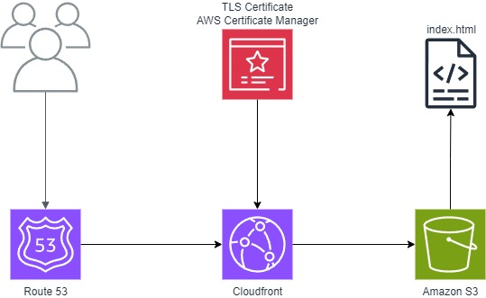

# Static Website Hosting with AWS

This Terraform project deploys the infrastructure needed to host a static website on AWS using S3 and CloudFront. Check the [AWS CloudFront and S3 Setup Guide](https://docs.aws.amazon.com/Route53/latest/DeveloperGuide/getting-started-cloudfront-overview.html) reference for setting up prerequisites (step 1 & 2 only).

## Architecture

The project creates:
1. An S3 bucket configured for static website hosting with public read access
2. A CloudFront distribution that uses the S3 website endpoint as its origin
3. Proper bucket policies and access configurations




## Prerequisites

Before deploying this infrastructure:

1. **Register a domain name**: You need a registered domain name that will point to your CloudFront distribution.
2. **Create a public SSL/TLS certificate**: You must have a public SSL certificate in AWS Certificate Manager (ACM) for your domain. The certificate must be in the `us-east-1` region for CloudFront to use it.

## Getting Started

1. Install Terraform (version 0.13.0 or newer recommended)
2. Clone this repository
3. Configure your AWS credentials
4. Rename & Update the terraform variables.tf.example file
5. Import the domain
```bash
terraform import aws_route53_zone.primary <PUT YOUR DOMAIN ID HERE>
```

6. Initialize and apply the Terraform configuration:

```bash
terraform init
terraform plan
terraform apply
```

## After Deployment

Once the infrastructure is deployed, you can:

1. Upload your static website files to the S3 bucket, you can upload the index.html as an example.

## License

This project is licensed under the MIT License - see the [LICENSE](LICENSE) file for details.

